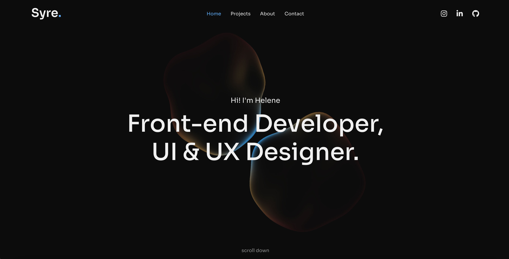

# Portfolio

**Desktop:** 

This is my personal portfolio website to showcase my projects, skills and experiences as a front-end developer.

## Description

This project is a Single Page Application (SPA) portfolio website created to showcase my work, skills, and background as a front-end developer. But also focuses on my background in visual communication and graphic design. The portfolio highlights selected projects (more will be added later) and demonstrates my approach to building responsive, user-focused, and visually consistent web experiences.

- **Home** – Introduction to who I am and what I do as a front-end developer. This page also includes projects and contact section.
- **Projects** – Projects with title, descriptions, technologies used, and links to live demos and GitHub repositories.
- **About** – Overview of my educations and work experiences.
- **Contact** – A contact form allowing visitors to get in touch. It also has social media and email linked.

## Built With

Main tools and technologies used in this project:


---

## Getting Started

### Installing

Follow these steps to get a copy of the project running locally:

1. Clone the repository:

   ```bash
   git clone https://github.com/helenesyre/portfolio.git
   ```

2. Open the repository:

   ```bash
    cd portfolio
   ```

3. Run Local Server

   Install dependencies and start the development server:

   ```bash
   npm install
   npm run dev
   ```

## Available Scripts

In the project directory, you can run:

- `npm run dev` – Runs the app in development mode.
- `npm run build` – Builds the app for production.
- `npm run preview` – Previews the production build locally.

---

## Contact

Helene Syre - [@syre_design](https://www.instagram.com/syre_design/) - syrehelene@gmail.com - [Linkedin](https://www.linkedin.com/in/helene-syre/)

Project Link: [https://helenesyre.github.io/portfolio/#/](https://helenesyre.github.io/portfolio/#/)

## Acknowledgments

I would like to thank my teachers and peers for everything we've learnt this year.

And for my inspirations I would also like to acknowledge [Dribbble](https://dribbble.com/) and [Awwwards](https://www.awwwards.com/) for design inspiration.
